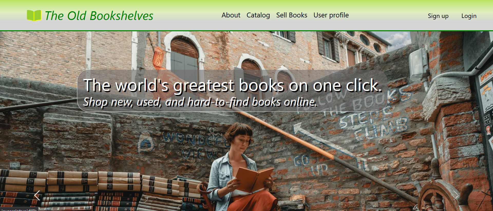

# The-Old-Bookshelves--Angular
This is a repository for a project defense to Software University Angular course.

## Tech Stack

   

## Demo

View a demo of this app [here](https://the-old-bookshelves.github.io).

## 🚀 About "The Old Bookshelves" web app

"The Old Bookshelves" is a web application representing an online bookstore. Visitors are able to find both new and second-hand books here, from recent editions to hard-to-find world literature. After successful registration every user can purchase a book from the site or put their books up for sale.

The client side of the app is a single page app, built with Angular and it is following the Angular development concepts. The application has a responsive design and аll components use separate CSS modules. Client-side routing, error handling and data validation are implemented.

Back4App is one of the popular BaaS (Backend as a Service) providers used here for backend purposes and storage. More information about Back4App can be found here: (https://www.back4app.com/).

The application consists of a public part (accessible without authentication) and a private part (available to registered users).

## Functionality and Pages

Home page

    - Dynamically slides view at the top of the page.
    - Loads five random books dynamically from the back-end.
    - Clicking on a book opens the details page of the current book.

About page

    - Shows information about the site.

Catalog page

    - Loads all books dynamically from the back-end.
    - Clicking on a book opens the details page of the current book.
    - You can search by author or by book title in the search bar at the top of the page.

Details pages

    - Loads details about the specific book dynamically from the backend, and (if logged in) a purchase can be made.
    - Also the owners of book can edit and delete their own books.
    - Authenticated users, not the owners of the current book, can buy the book.
    - Authenticated users are able to rate the books.

User Registration (on Registering page)

    - Registering a new user is possible by providing username, email and password.

User Login (on the Login page)

    - Login is possible with email and password.

User Logout (in Header right to the shown username)

    - Logout from the application.

Sell-book page

    - A new book for sale entry can be created and saved into the database (only for authenticated users).

Edit page

    - Existing books can be edited and saved into the database (only for owner users).

Delete book

    - Removing an existing book entry from the database (only for owner users).

User profile page

    - Loads dynamically from the back-end details about the current user.
    - Loads dynamically from back-end all books that current user created for sale.
    - Loads dynamically from back-end all purchases of the current user.
    - Clicking on a book opens the details page of the current book.

Guard page

    - This page is displayed when an unauthenticated user tries to access a page that requires authentication.

Page 404

    - This page is displayed when the path we are trying to access is not valid.

## Screenshots



## Run Locally

Clone the project

```bash
  git clone https://github.com/Ivaylo-St-Ivanov/The-Old-Bookshelves--Angular.git
```

Install dependencies

```bash
  cd client
  npm i
```

Start the application with

```bash
  ng s
```

You can view the app by open http://localhost:4200 in your browser.

## Author

- [@IVo](https://github.com/Ivaylo-St-Ivanov) 👋

## 🔗 Links

[](https://www.linkedin.com/in/ivaylo-st-ivanov)

## Feedback

If you have any feedback, please reach out to me at ivailo.st.ivanov@gmail.com

## License

[](https://choosealicense.com/licenses/mit/)